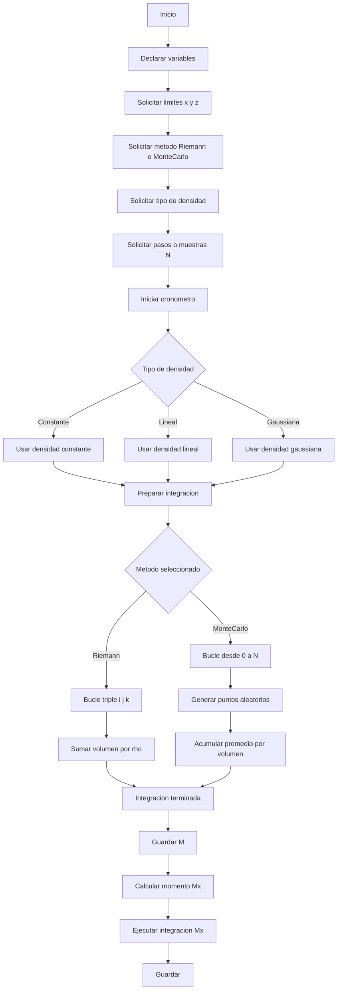

# 📘 Cálculo de Masa y Centro de Masa (Integración Triple en C)

*Curso:* Cálculo Vectorial Computacional
*Institución:* Universidad Nacional de Colombia – Departamento de Matemáticas y Estadística
*Autora:* Luisa Fernanda Castro Buesaquillo (@Luisa-casstro)

---

##  Estructura del Proyecto

La estructura del proyecto se organiza de forma jerárquica para facilitar la claridad y el mantenimiento del código:


```
triple_integral/
├── src/                  
│   ├── main.c            
│   ├── densidades.c      
│   └── integracion.c     
│
├── include/              
│   ├── densidades.h     
│   └── integracion.h  
│
├── obj/                  
├── programa_vectorial   
└── Makefile             
```

---

##  Diagrama de Flujo del Programa

A continuación se muestra el diagrama completamente renderizable en GitHub:

`mermaid

##  Fundamento Teórico
El proyecto calcula numéricamente:

**Masa total:** Integral triple de la densidad sobre el volumen.  
**Centro de masa:** Cociente entre los momentos y la masa.

### **Densidades disponibles**
- Constante: rho = 1
- Lineal: rho = x + y + z
- Gaussiana: rho = exp(-(x^2 + y^2 + z^2))

### **Métodos implementados**
- Sumas de Riemann
- Monte Carlo (optimizado)

---

##  Diagrama de Flujo del Programa



---

##  Compilación y Ejecución

### **Compilar**


make


### **Ejecutar**


./programa_vectorial


### **Limpiar**


make clean


---

##  Resultados

El programa genera un archivo:


resultados.csv


Contiene columnas: Metodo, Densidad, N, M, x_bar, y_bar, z_bar, Tiempo

Ejemplo:


MonteCarlo,Gaussiana,100000,12.5831,0.1020,-0.0030,0.2210,0.0872
Riemann,Lineal,50,250.00,5.00,5.00,5.00,0.1540
```

---

##  Preguntas frecuentes hechas a ChatGPT

* ¿Cómo organizar el proyecto en carpetas?
* ¿Cómo compilar con Makefile?
* ¿Cómo optimizar Monte Carlo?
* ¿Cómo corregir errores de includes relativos?
* ¿Cómo generar diagramas Mermaid?
* ¿Cómo exportar resultados?

---

##  Autor

*Luisa Fernanda Castro Buesaquillo*
Estudiante de Cálculo Vectorial Computacional
Universidad Nacional de Colombia
